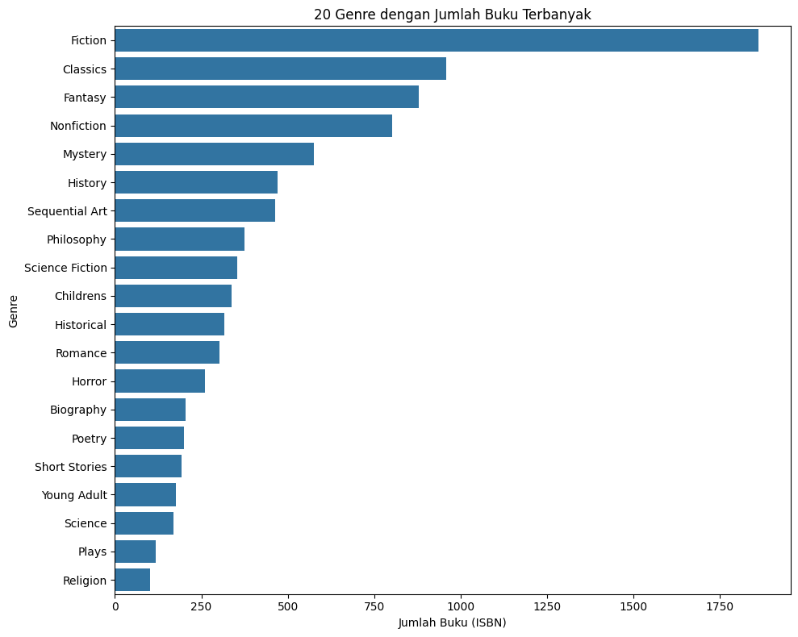
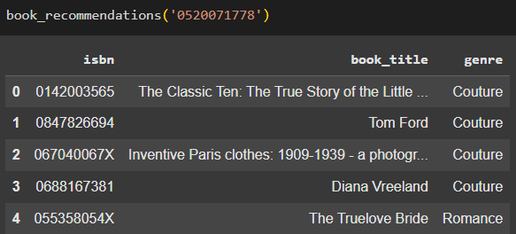
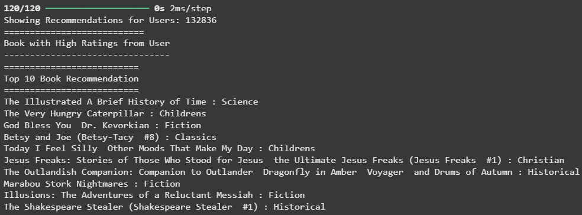
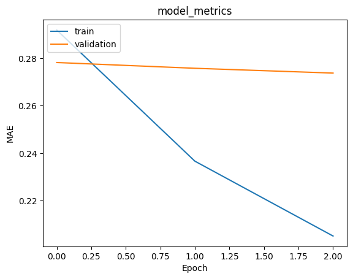

# Laporan Proyek Machine Learning Sistem Rekomendasi Buku - Dina Nabila

## Project Overview

Semenjak platform seperti YouTube, Netflix, dan sejenisnya muncul, sistem rekomendasi semakin sering kita temui dalam kehidupan sehari-hari. Mulai dari e-commerce yang memberi saran produk yang mungkin kita suka, sampai ke iklan online yang menyesuaikan konten dengan minat kita. 

Secara umum, sistem rekomendasi adalah algoritma yang bertujuan menyajikan konten atau pilihan yang relevan bagi pengguna. Di industri hiburan, seperti film dan musik, ini sudah menjadi hal lumrah. Namun di industri lain, seperti literasi atau buku, sistem ini belum banyak dimanfaatkan secara optimal.

Padahal, penerapan sistem rekomendasi dalam dunia perbukuan bisa menjadi terobosan penting untuk meningkatkan minat baca, terutama di era digital yang serba instan. Menurut survei oleh Perpustakaan Nasional Republik Indonesia (Perpusnas) dan PT Indekstat Konsultan Indonesia pada tahun 2024, Tingkat Gemar Membaca (TGM) masyarakat Indonesia mengalami peningkatan dari 66,70 menjadi 72,44, menunjukkan tren positif dalam kegemaran membaca masyarakat (Hariyanto, 2024). Namun, tantangan masih ada, terutama dalam menyediakan bahan bacaan yang menarik dan relevan bagi pembaca.

Salah satu solusi untuk mengatasi tantangan ini adalah dengan mengimplementasikan sistem rekomendasi berbasis machine learning dalam platform buku digital. Sistem ini dapat menganalisis preferensi dan perilaku membaca pengguna untuk menyarankan buku-buku yang sesuai dengan minat mereka. Dengan demikian, pengguna akan lebih termotivasi untuk membaca, karena mereka mendapatkan rekomendasi yang relevan dan menarik.

Lebih lanjut, penelitian oleh Sun et al. (2024) menunjukkan bahwa sistem rekomendasi berbasis deep learning memiliki keunggulan dalam menyajikan rekomendasi yang lebih personal dan relevan dibandingkan metode tradisional. Namun, penting untuk memastikan bahwa sistem tersebut juga mempertimbangkan aspek keberagaman dan transparansi agar pengguna merasa puas dan percaya terhadap rekomendasi yang diberikan.

Berdasarkan latar belakang tersebut, proyek ini penting untuk dikembangkan karena berpotensi:
- Menjadi solusi dalam menumbuhkan kembali minat baca di era digital.
- Memberikan rekomendasi buku yang personal dan relevan.
- Menawarkan pengalaman pengguna yang lebih menarik dan interaktif.
- Mendukung pengembangan teknologi di bidang literasi, bukan hanya hiburan.


## Business Understanding

Berdasarkan latar belakang yang sudah dipaparkan sebelumnya, berikut pernyataan masalah, tujuan, beserta solusi yang dirancang untuk mendukung pengembangan sistem rekomendasi buku berbasis machine learning yang relevan dan personal bagi pengguna. 

### Problem Statements

Berikut pernyataan masalah yang perlu diselesaikan berdasarkan latar belakang yang telah dijelaskan sebelumnya:
- Meskipun minat baca masyarakat Indonesia menunjukkan tren peningkatan, masih terdapat tantangan dalam menyediakan bacaan yang relevan dan menarik secara konsisten. Untuk itu, pernyataan masalah yang perlu dijawab adalah: **bagaimana cara merekomendasikan buku yang sesuai dengan minat dan preferensi pembaca secara otomatis?**
- Sistem rekomendasi tradisional seringkali gagal dalam memberikan pengalaman yang personal dan kurang mampu menyesuaikan diri dengan pola perilaku membaca pengguna. Oleh karena itu, perlu dijawab: **sejauh mana sistem rekomendasi berbasis machine learning, khususnya deep learning, dapat meningkatkan relevansi dan personalisasi dalam menyarankan buku kepada pengguna?**

### Goals

Berikut tujuan yang harus dicapai guna menyelesaikan pernyataan masalah di atas:
- Mengembangkan sistem rekomendasi buku berbasis machine learning yang mampu memberikan saran bacaan personal berdasarkan histori dan preferensi pengguna.
- Mengevaluasi performa model rekomendasi serta membandingkan efektivitas pendekatan content based filtering dengan collaborative filtering.

### Solution Statements

Berikut solusi yang perlu dilakukan untuk menjawab pernyataan masalah dan mencapai tujuan proyek:

- Untuk goal pertama, solusi yang diterapkan adalah:
  - Mengumpulkan dan membersihkan data rating buku serta preferensi pengguna dari platform buku digital.
  - Membangun dan melatih dua pendekatan utama sistem rekomendasi, yaitu:
    - **Content-Based Filtering**: menggunakan informasi dari genre buku beserta ISBN-nya.
    - **Collaborative Filtering**: menggunakan pola interaksi antar pengguna untuk merekomendasikan buku yang disukai oleh pengguna lain dengan minat serupa.

- Untuk goal kedua, solusi yang diterapkan adalah:
  - Menghitung proporsi buku rekomendasi yang memiliki genre yang sama dengan buku acuan untuk mengukur performa model content based filtering.
  - Menggunakan metrik evaluasi MAE untuk mengukur performa model collaborative filtering.


## Data Understanding
Dataset [Kaggle Book Recommendation Dataset](https://www.kaggle.com/datasets/arashnic/book-recommendation-dataset) dengan total jumlah data 1.645.998 baris dan 12 kolom beserta [Kaggle Goodreads-books-with-genres](https://www.kaggle.com/datasets/middlelight/goodreadsbookswithgenres) dengan jumlah data 11.127 baris dan 13 kolom digunakan untuk melatih model rekomendasi buku sebagai solusi permasalahan yang telah dijabarkan sebelumnya. 

Berikut variabel yang tersedia dalam dataset **Kaggle Goodreads-books-with-genres**:

**DataFrame genres_df:**

- **Book Id**: ID unik untuk setiap buku.
- **Title**: Judul dari buku.
- **Author**: Nama penulis buku.
- **average_rating**: Rata-rata rating yang diberikan oleh pembaca terhadap buku tersebut.
- **isbn**: Nomor ISBN versi 10 digit, digunakan sebagai identifikasi unik buku.
- **isbn13**: Nomor ISBN versi 13 digit, juga digunakan sebagai identifikasi unik buku.
- **language_code**: Kode bahasa buku (misalnya "en" untuk bahasa Inggris).
- **num_pages**: Jumlah halaman dalam buku.
- **ratings_count**: Jumlah total rating yang diterima oleh buku.
- **text_reviews_count**: Jumlah total ulasan dalam bentuk teks yang diberikan oleh pengguna.
- **publication_date**: Tanggal terbit buku (dalam format teks).
- **publisher**: Nama penerbit buku.
- **genres**: Genre atau kategori buku (misalnya: "Fiction", "Fantasy", "Non-Fiction"), bisa terdiri dari lebih dari satu genre.

Selanjutnya, berikut variabel-variabel yang tersedia dalam dataset **Kaggle Book Recommendation Dataset**: 

**DataFrame books_df:**

- **ISBN**: Nomor ISBN buku (sebagai identifikasi unik buku).
- **Book-Title**: Judul buku.
- **Book-Author**: Nama penulis buku.
- **Year-Of-Publication**: Tahun terbit buku (dalam format teks, bisa mengandung nilai tidak valid).
- **Publisher**: Nama penerbit buku.
- **Image-URL-S**: URL gambar sampul buku ukuran kecil.
- **Image-URL-M**: URL gambar sampul buku ukuran sedang.
- **Image-URL-L**: URL gambar sampul buku ukuran besar.

**DataFrame ratings_df:**

- **User-ID**: ID unik pengguna yang memberikan rating.
- **ISBN**: Nomor ISBN buku yang diberi rating.
- **Book-Rating**: Nilai rating yang diberikan pengguna terhadap buku (biasanya dari 0 sampai 10).

**DataFrame users_df:**

- **User-ID**: ID unik untuk setiap pengguna.
- **Location**: Lokasi pengguna (biasanya dalam format "kota, provinsi, negara").
- **Age**: Usia pengguna (dalam tahun, bertipe numerik desimal karena sebagian data mungkin tidak lengkap).


### Exploratory Data Analysis


**Insights:**

**DataFrame books_df**
- memiliki **7 kolom** dengan **217360 baris data**
- memiliki 2 missing values pada kolom Book-Author dan Publisher dan 3 missing values pada kolom Image-URL-L
- tidak terdapat duplikasi data

**DataFrame ratings_df**
- memiliki **3 kolom** dengan **1149780 baris data**
- tidak memiliki missing values
- tidak terdapat duplikasi data

**DataFrame users_df**
- memiliki **3 kolom** dengan **278858 baris data**
- memiliki missing values pada kolom Age
- tidak terdapat duplikasi data

**DataFrame genres_df**
- memiliki **13 kolom** dengan **11127 baris data**
- memiliki 97 missing values pada kolom genres
- tidak terdapat duplikasi data



**Insights:**

Genre dengan jumlah buku terbanyak adalah Fiction, diikuti Classics, lalu Fantasy. Sementara genre buku dengan jumlah buku tersedikit dalam 20 besar jatuh pada genre Religion, diikuti Plays, lalu Science. 

## Data Preparation

### Untuk Model Content Based Filtering
Fitur yang digunakan untuk model dengan pendekatan content based filtering semuanya diambil dari DataFrame genre_df:
- ISBN
- Title
- Genre

dengan total masing-masing baris data sebanyak 10879. 

```
genre_isbn = genre_df['ISBN'].tolist()
genre_title = genre_df['Title'].tolist()
genre_genre = genre_df['Genre'].tolist()

genre_new = pd.DataFrame({
  'isbn': genre_isbn,
  'book_title': genre_title,
  'genre': genre_genre,
})
```

Agar DataFrame awal (genre_df) tidak ikut berubah, ketiga fitur tersebut dimasukkan ke dalam variabel baru dan diubah menjadi list, lalu masing-masing list tersebut dimasukkan ke dalam satu DataFrame baru yang dinamakan genre_new.


### Untuk Model Collaborative Filtering

Untuk model collaborative filtering, fitur yang digunakan adalah User-ID, ISBN, dan Book-Rating, di mana ketiganya sama-sama diambil dari DataFrame ratings_df.

Langkah-langkah data preparation yang perlu dilakukan untuk model ini terurut sebagai berikut:

**1. Encode fitur User-ID dan ISBN ke dalam indeks integer**

Pada proyek ini, proses encode dilakukan dengan dictionary mapping manual. 

```
rating = ratings_df
rating.head(2)

user_ids = rating['User-ID'].unique().tolist()
user_to_user_encoded = {x: i for i, x in enumerate(user_ids)}
rating['user_encode'] = rating['User-ID'].map(user_to_user_encoded)

isbns = rating['ISBN'].unique().tolist()
isbn_to_isbn_encoded = {x: i for i, x in enumerate(isbns)}
rating['isbn_encode'] = rating['ISBN'].map(isbn_to_isbn_encoded)
```

Kedua fitur ini penting untuk di-encode, sebab algoritma machine learning seperti embedding tidak bisa langsung memproses data dalam bentuk nilai yang masih bertipe data string. Jadi masing-masing harus diubah jadi numerik terlebih dahulu dengan encoding.

**2. Ubah tipe data Book-Rating menjadi float**

```
rating['Book-Rating'] = rating['Book-Rating'].astype(np.float32)
```

Tipe data Book-Rating perlu diubah menjadi float, sebab banyak algorima yang membutuhkan input numerik dengan tipe float, terutama saat menghitung error (misalnya MSE - Mean Squared Error).

**3. Bagi data menjadi training dan validation set**

```
X = rating[['user_encode', 'isbn_encode']].values

y = rating['Book-Rating'].apply(lambda x: (x - min_rating) / (max_rating - min_rating)).values

train_indices = int(0.8 * rating.shape[0])
X_train, X_val, y_train, y_val = (
  X[:train_indices],
  X[train_indices:],
  y[:train_indices],
  y[train_indices:]
)
```
- Variabel X didefinisikan untuk mencocokkan data user_encode dan isbn_encode menjadi satu value
- Variabel y diisi oleh data rating yang dinormalisasi dengan metode min-max
- Terakhir, data dibagi menjadi 80% data train dan 20% data validasi. Dengan membagi data, kita bisa mengukur seberapa baik model melakukan generalisasi ke data baru

**4. Membuat TF-IDF dari Genre Buku**

```
tf = TfidfVectorizer()
tf.fit(genre_new['genre'])
tfidf_matrix = tf.fit_transform(genre_new['genre'])
```

- TfidVectorizer() digunakan untuk mengubah teks (genre) menjadi angka berdasarkan seberapa penting kata tersebut.
- TF-IDF = Term Frequency - Inverse Document Frequency: memberi bobot tinggi ke kata unik dan bobot rendah ke kata umum.
- Hasilnya berupa matrik angka yang mewakili setiap buku.

**5. Membuat Matriks TF-IDF ke DataFrame**

```
tf = TfidfVectorizer()
tf.fit(genre_new['genre'])
tfidf_matrix = tf.fit_transform(genre_new['genre'])
```

Ini untuk melihat isi matriks TF-IDF dalam bentuk tabel. Kolom adalah kata-kata genre, baris adalah ISBN buku.


## Modeling
Terdapat 2 model yang dibangun untuk sistem rekomendasi buku pada proyek ini. Model pertama menggunakan pendekatan content based filtering, sementara model kedua menggunakan pendekatan collaborative filtering dengan menggunakan algoritma yang terinspirasi dari [tutorial Keras](https://keras.io/examples/structured_data/collaborative_filtering_movielens/). Masing-masing model nantinya akan menyajikan top-N recommendation sebagai output. 

Berikut penjelasan cara kerja kedua algoritma beserta kelebihan dan kekurangannya masing-masing. 

### Algoritma 1: Content Based Filtering

Rekomendasi diberikan dengan menghitung kemiripan antar buku berdasarkan genre. Semakin mirip genre-nya, semakin besar kemungkinan buku itu direkomendasikan.

#### Cara Kerja: 

**1. Hitung Kemiripan Antar Buku (Cosine Similarity)**

```
cosine_sim = cosine_similarity(tfidf_matrix)
cosine_sim_df = pd.DataFrame(cosine_sim, index=genre_new['isbn'], columns=genre_new['isbn'])
```

- Cosine similarity menghitung sejauh mana dua vektor (buku)
 mirip
 - Nilai 1 = sangat mirip, 0 = tidak mirip
 - Hasil akhirnya berupa matriks kemiripan antar semua pasangan buku berdasarkan genre-nya


 **2. Membuat Fungsi Rekomendasi Buku**

 ```
 def book_recommendations(isbn, similarity_data=cosine_sim_df, items=genre_new[['isbn', 'book_title', 'genre']], k=5):
    similarities = similarity_data[isbn].drop(labels=isbn, errors='ignore')
    top_k_titles = similarities.sort_values(ascending=False).head(k).index
    return pd.DataFrame(top_k_titles, columns=["isbn"]).merge(items, on="isbn", how="left")
 ```

 - Fungsi ini menerima ISBN buku utama
 - Lalu mengambil buku lain dengan nilai similarity tertinggi terhadap buku tersebut (tapi tidak termasuk dirinya sendiri)
 - Dan terakhir mengembalikan k buku yang paling mirip berdasarkan genre


#### Inferensi Sederhana:

Berikut contoh hasil top n recommendation dengan pendekatan content-based filtering:




#### Kelebihan:
- Tidak memerlukan data user. Model ini hanya menggunakan data genre buku, jadi bisa langsung dipakai tanpa histori interaksi pembaca
- Bisa merekomendasikan item baru (cold start user). Selama buku punya genre, buku tersebut bisa direkomendasikan meski belum pernah ada yang membacanya
- Cepat dan ringan secara komputasi. TF-IDF dan cosine similarity cukup efisien dibanding metode lain seperti deep learning


#### Kekurangan:

- Hanya fokus pada genre buku. Rekomendasi tidak mempertimbangkan apakah buku tersebut disukai pengguna lain atau tidak
- Kurang variatif, sebab rekomendasi dilakukan hanya berdasarkan kemiripan kontekn, sehingga hasilnya sering terlalu "seragam" dan tidak mengeksplorasi genre lain
- Genre saja mungkin tidak cukup mewakili isi keseluruhan buku, apalagi jika hanya satu genre yang dicatat
- Model ini tidak belajar dari apa yang pengguna sukai atau tidak sukai sebelumnya


### Algoritma 2: Collaborative Filtering

Model ini menggunakan perpaduan embedding dan neural network untuk belajar dari data interaksi user dan buku, supaya bisa memprediksi rating atau kesukaan user terhadap buku yang belum pernah mereka baca.  

#### Cara Kerja: 

**1. Input**

Model ini menerima input dalam bentuk pasangan [user_id, book_id], artinya makna satu baris data adalah: "User X membaca Book Y"

**2. Embedding Layer**

```
self.user_embedding = layers.Embedding(...)
self.book_embedding = layers.Embedding(...)
```

Bagian ini digunakan untuk memberi setiap user dan buku representasi angka (disebut embedding vector), supaya model bisa memahami karakteristik user dan buku. 

Misalnya: User A suka buku fantasi, embedding-nya akan mencerminkan itu. Buku Z adalah genre misteri, embedding-nya juga menunjukkan karakter tersebut.

```
self.user_bias = layers.Embedding(...)
self.book_bias = layers.Embedding(...)
```

Bias digunakan untuk menunjukkan "kecenderungan". Misalnya ada user yang suka memberi rating tinggi, atau misalkan buku yang banyak disukai semua orang.

**3. Menggabungkan Embedding**

```
dot_user_book = tf.reduce_sum(user_vector * book_vector, axis=1, keepdims=True)
```

Perkalian dot product antara embedding user dan buku. Hasilnya menunjukkan seberapa cocok user dan buku ini secara matematis. Apabila antara dua vektor mirip arahnya, artinya hasilnya besar, dan itu artinya user kemungkinan suka buku itu. 

Lalu hasil tersebut dijumlah dengan bias:

```
X = dot_user_book + user_bias + book_bias
```

**4. Neural Network Layer**

```
self.dense1 = layers.Dense(64, activation='relu')
self.dropout1 = layers.Dropout(0.3)
self.dense2 = layers.Dense(32, activation='relu')
self.dropout2 = layers.Dropout(0.3)
```

Di sini hasil perkalian tadi masuk ke lapisan neural network, yang tugasnya menambah kompleksitas pemahaman model supaya tidak cuma lihat cocok/tidak cocok, tapi juga bisa "belajar pola" lebih dalam.

Dropout digunakan agar model tidak mudah overfitting (terlalu hafal dengan data latih)

**5. Ouput Layer**

```
self.output_layer = layers.Dense(1)
return tf.nn.sigmoid(x)
```

Terakhir, dengan menggunakan sigmoid, nilai antara 0 sampai 1 dihasilkan, dengan interpretasi: 
- Mendekati 1: kemungkinan besar user akan suka buku ini
- Mendekati 0: kemungkinan besar tidak suka

**6. Callback**

```
early_stop = EarlyStopping(...)
lr_reduce = ReduceLROnPlateau(...)
callbacks = [early_stop, lr_reduce]
```

- EarlyStopping: jika validasi RMSE tidak membaik selama 5 kali, maka training dihentikan
- ReduceLROnPlateau: jika validasi RMSE mandek, learning rate diturunkan supaya belajar lebih pelan

**7. Compile Model**

```
# inisialisasi model dengan jumlah user dan buku, serta ukuran embedding 64
model = RecommenderNet(num_users, num_books, embedding_size=64)

model.compile(
  loss=tf.keras.losses.MeanSquaredError(), 
  optimizer=tf.keras.optimizers.Adam(learning_rate=0.002), 
  metrics=[
    tf.keras.metrics.RootMeanSquaredError(name="rmse"),
  ]
)
```

- Model dilatih untuk meminimalkan perbedaan antara rating asli (y_train) dan rating yang diprediksi
- Loss function yang digunakan adalah Mean Squared Error (MSE)
- Metrik evaluasi yang digunakan adalah Root Mean Squared Error (RMSE) 
- Selama training, model belajar memperbaiki bobot embedding dan dense layers agar prediksinya semakin akurat


**8. Output Akhir (Setelah Training Model)**

```
history = model.fit(
  x = X_train,
  y = y_train,
  batch_size = 700,
  epochs = 3,
  validation_data = (X_val, y_val),
  callbacks=callbacks,
)
```

Selama proses pelatihan model berlangsung, data akan dibagi menjadi kelompok-kelompok (batch) berisi 700 data. Tujuannya agar pelatihan berjalan dengan lebih efisien, tidak memuat semua data sekaligus ke memori.

Model juga akan melihat (melatih diri dengan) seluruh data latih sebanyak 3 kali (epochs = 3). Tiap 1 kali lihat seluruh data disebut 1 epoch.

Setelah model dilatih, kita bisa memasukkan pasangan [user_id, book_id] dan model akan memberikan nilai probabilitas user suka buku itu. 

#### Inferensi Sederhana:

Berikut contoh hasil top n recommendation dengan pendekatan collaborative filtering:




#### Kelebihan:

- Cocok untuk dataset besar (misal ribuan user dan buku), karena embedding hanya menyimpan vektor berdimensi kecil
- Adanya Dense Layer (lapisan neural network) membuat model bisa mengenali pola interaksi kompleks antara user dan buku
- Terdapat regularisasi L2 di layer embedding dan dropout untuk mencegah overfitting
- Modular dan mudah dikembangkan karena dibuat dengan Keras dan Python, fitur baru bisa ditambahkan dengan relatif mudah

#### Kekurangan:

- Hanya mengandalkan ID (tanpa fitur tambahan), tidak tahu apa-apa soal isi buku atau profil user. Artinya apabila ada user atau buku baru yang belum pernah muncul (cold start), model tidak bisa memberikan prediksi yang baik
- Tidak menggunakan konteks atau waktu. Misalnya, mungkin user dulunya suka fiksi, sekarang suka nonfiksi. Tapi model tidak tahu karena tidak ada informasi waktu atau urutan interaksi
- Karena modelnya cukup kompleks (embedding + dense layer), kadang butuh waktu lebih banyak untuk dilatih
- Butuh penyesuaian hyperparameter (seperti learning rate, ukuran embedding) agar hasil optimal
- Karena output layer-nya menggunakan sigmoid, nilai prediksi berada di antara 0-1. Kalau data rating aslinya berupa skala 1-5, perlu penyesuaian agar interpretasinya lebih masuk akal.


## Evaluation

### Untuk Model Content Based Filtering

Metrik yang digunakan adalah genre match accuracy, yaitu proporsi buku rekomendasi yang memiliki genre yang sama dengan buku acuan. Metrik ini cocok karena sistem menggunakan pendekatan content based filtering berbasis genre, dan tidak tersedian feedback pengguna seperti rating.

**Rumus Metrik**

Genre Match Accuracy = (jumlah rekomendasi dengan genre yang sama) / (jumlah total rekomendasi)

**Cara Kerja Metrik Evaluasi**

1. Ambil sampel acak dari data
2. Evaluasi setiap rekomendasi
3. Hitung rata-rata skor
4. Hasil: berdasarkan 500 ISBN acak, diperoleh: 
Average genre match accuracy: 
0.9996


Dari 500 sampel ISBN acak, diperoleh akurasi average gebre match accuracy sebesar **0.9996**. Ini artinya, model sudah sangat baik untuk memprediksi rekomendasi Top-N buku.

**Kode**

```
all_isbns = genre_new['isbn'].unique()
sample_isbns = random.sample(list(all_isbns), 500)
genre_match_scores = []

def genre_match_evaluation(isbn_acuan, rekomendasi_df, data_genre):
  try:
    genre_asli = data_genre[data_genre['isbn'] == isbn_acuan]['genre'].values[0]
  except IndexError:
    return 0  # genre buku acuan tidak ditemukan

  # Ambil genre dari setiap ISBN yang direkomendasikan
  rekomendasi_df = rekomendasi_df.dropna(subset=['isbn'])  # untuk memastikan tidak ada NaN
  genre_rekomendasi = rekomendasi_df['isbn'].map(
    lambda x: data_genre[data_genre['isbn'] == x]['genre'].values[0]
    if x in data_genre['isbn'].values else None
  )

  genre_rekomendasi = genre_rekomendasi.dropna()

  if len(genre_rekomendasi) == 0:
    return 0

  # Hitung berapa banyak genre yang cocok
  match_count = sum(genre_rekomendasi == genre_asli)

  return match_count / len(genre_rekomendasi)

for isbn in sample_isbns:
  try:
    rekomendasi = book_recommendations(isbn)
    score = genre_match_evaluation(isbn, rekomendasi, genre_new)
    genre_match_scores.append(score)
  except:
    continue

average_genre_accuracy = sum(genre_match_scores) / len(genre_match_scores)
print("Average genre match accuracy:", average_genre_accuracy)
```

### Untuk Model Collaborative Filtering

Metrik utama yang digunakan untuk mengevaluasi performa model collaborative filtering adalah **Mean Absolute Error (MAE)**. Pemilihan metrik ini dipilih berdasarkan karakteristik masalah, yakni rekomendasi buku berdasarkan rating.

Berikut hasil evaluasi akhir yang diperoleh dari pelatihan model: 



Berdasarkan plot di atas, dapat dilihat bahwa nilai MAE pada data training secara bertahap mengalami penurunan yang signifikan hingga mencapai titik konvergensi di sekitar nilai 0.20. Sementara itu, MAE pada data validasi tetap stabil di kisaran 0.28 tanpa indikasi kenaikan, yang menandakan bahwa model tidak mengalami overfitting secara drastis.

Dengan hasil MAE validasi yang tetap stabil di kisaran 0.28 dan MAE training yang turun ke 0.20, model sudah menunjukkan performa cukup baik dan belum menunjukkan tanda overfitting yang ekstrem.

Meskipun masih terdapat gap antara performa train dan validation, besarnya selisih ini masih dalam batas wajar dan umum ditemukan pada model rekomendasi berbasis embedding. 

Untuk mengatasi hal tersebut, saran untuk upaya selanjutnya yang dapat dilakukan bisa dengan melakukan tuning hyperparameter lebih lanjut, atau bisa juga menambahkan fitur lain seperti usia pengguna agar dapat menutup gap tersebut dan mendorong peningkatan performa model ke arah yang lebih optimal.

**Rumus MAE**

$$
\text{MAE} = \frac{1}{n} \sum_{i=1}^{n} \left| y_i - \hat{y}_i \right|
$$

$$\text{di mana:}$$

$$n = \text{jumlah total sampel/data}$$
$$y_i = \text{nilai rating aktual (ground truth)}$$
$$\hat{y}_i = \text{nilai rating yang diprediksi oleh model}$$
$$|y_i - \hat{y}_i| = \text{selisih absolut antara nilai aktual dan nilai prediksi}$$

**Cara Kerja Metrik MAE**

- Menghitung rata-rata dari semua selisih absolut antara rating yang diprediksi dan rating sebenarnya.

- Semakin rendah MAE lebih rendah, semakin akurat hasil prediksi.

- Tidak menghitung arah kesalahan (under/over prediction), hanya besar kesalahannya saja.

**Alasan MAE cocok untuk collaborative filtering**

- MAE mudah dipahami dan diinterpretasikan: contohnya, MAE = 0.25 berarti secara rata-rata model meleset 0.25 poin dari rating aktual (misalnya di skala 1–5).

- MAE tidak terlalu sensitif terhadap outlier, tidak seperti MSE yang menghukum kesalahan besar dengan kuadrat.


### Kesimpulan Bisnis

Berdasarkan hasil yang telah diperoleh, seluruh pernyataan masalah (problem statement) proyek ini telah berhasil dijawab melalui pendekatan yang tepat. Tantangan dalam merekomendasikan buku yang relevan dan menarik bagi pembaca diselesaikan dengan membangun sistem rekomendasi otomatis yang memanfaatkan dua pendekatan utama, yaitu content based filtering dan collaborative filtering. Sistem ini memungkinkan pemberian rekomendasi yang bersifat personal, didasarkan pada preferensi dan histori pengguna, serta menunjukkan potensi dalam mengatasi keterbatasan sistem tradisional yang kurang adaptif terhadap perilaku individual. 

Selain itu, pendekatan machine learning dengan metode embedding dalam collaborative filtering terbukti mampu meningkatkan kualitas rekomendasi secara signifikan dengan hasil metrik evaluasi genre match accuracy yang tinggi, yaitu 1, dari 500 sampel acak. Hasil ini menandakan kemampuan sistem dalam menyarankan buku dengan genre yang relevan. Sementara itu, Collaborative Filtering menunjukkan penurunan nilai Mean Absolute Error (MAE) pada data pelatihan hingga mencapai 0.20, dengan nilai MAE validasi yang stabil di kisaran 0.28. Stabilitas ini menjadi indikasi bahwa model tidak mengalami overfitting secara drastis, dan masih memiliki ruang untuk peningkatan lebih lanjut.

Proyek ini membuka ruang untuk inovasi berkelanjutan dalam pengembangan sistem rekomendasi buku yang lebih cerdas dan adaptif. Agar dapat diimplementasikan secara real, masih diperlukan pengembangan lebih lanjut untuk antarmuka dengan pengguna. Selain itu, model dapat dikembangkan lebih baik lagi dengan tuning hyperparameter, atau meningkatkan performa dengan memperbaiki arsitektur model yang telah dibangun pada proyek ini. 


## Referensi
- [Hariyanto, P. (2024). Hasil Riset 2024, Masyarakat Indonesia Kian Gemar Membaca.](https://nasional.sindonews.com/read/1510177/15/hasil-riset-2024-masyarakat-indonesia-kian-gemar-membaca-1735557169)
- [Sun, R., Wu, X., Akella, A., Kong, R., Knijnenburg, B., & Konstan, J. A. (2024). What Are We Optimizing For? A Human-centric Evaluation of Deep Learning-based Movie Recommenders.](https://arxiv.org/abs/2401.11632)